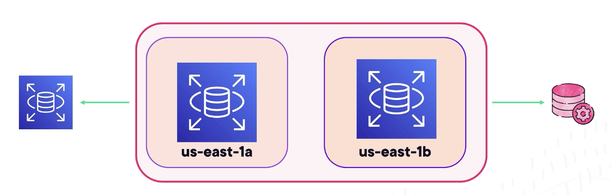
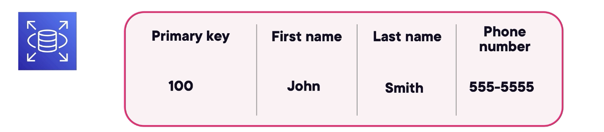

# Cloud Foundations and Compute

## AWS Compute Services - Powering Your Applications

### AWS Compute Services
- Three Main Benefits of Compute Services
	- Run applications without managing physical servers
	- Flexibility that allows to choose different types of computing power
	- Scalability where AWS provides a way to scale up or down
- Amazon EC2 (Compute Option)
	- Allows you to rent a computer on demand
	- Choose size and power that fits your needs
	- Pay only for what you use
	- Good for websites, business apps, and large data processing
- Amazon ECS (Compute Option)
	- Allows you to run and manage containerized applications
	- Handles scaling and placement of containers automatically
	- Works with EC2 or Fargate for flexible deployment
	- Great for modular apps, growing apps, and batch tasks
- Amazon EKS (Compute Option)
	- Allows you to run and manage Kubernetes applications
	- Automates scaling and deployments
	- Works with EC2 or Fargate for flexible deployment
	- Great for complex applications needing high availability and portability
- **Amazon Lambda** (Compute Option)
	- Runs code only when an event happens
	- No need to manage servers or resources
	- Automatically scales to handle more users
	- Only pay for the time your code runs, which saves money

### Key Features of EC2
- EC2 Instance Types
	- General Purpose: A balance of compute, memory, and networking for everyday applications
	- Compute optimized: Best for applications that need high processing power
	- Memory Optimized: Big data processing
	- Storage Optimized: Workloads that need fast and large-scale storage
	- Accelerated Computing: Uses GPUs or other hardware for machine learning and 3D rendering
- EC2 Features that Enhance Performance
	- Autoscaling: Ensures that the application has the right number of servers to handle the right demand
	- Load balacing: Spread traffic through multiple instances (pay-as-you-go)
- Choosing the Right Pricing Model
	- 

### AWS Support for Containerized Applications
- Container includes the application, code (logic/functionality), and runtime (dependency)
- If container crahses, another container is available, keeping the service online
- Container Services
	- **AWS ECS (Elastic Container Service)**: Fullly managed service for running containers at scale that allows to run and manage tasks
		- Tasks are the key execution units that can have one or multiple containers running inside of it --> multiple components inside a single/multiple task(s)
	- **AWS EKS (Elastic Kubernetes Service)**: Runs Kubernetes (ideal if already being used) which is an open source system for automated container orchestration
		- Has nodes which are machines where containers run
		- A node can have multiple pods that are Kubernetes containerized workloads
		- A control plane manages how Kubernetes coordinate their workloads across the cluster
		- Handles scheduling, scaling, networking, 
	- **AWS Fargate**: Serverless container service that removes the need to manage underlying infrastructure/containers 
		- Automatically provisions and scales the necesary infrastructure
		- AWS handles everything
		- Ideal of businesses that want to run containers without worrying about the infrastructure maintenance, enabling fully serverless container deployment
- Common Use Cases for Containers on AWS
	- User sign-in, Payment Processes, Tracking/processing orders

### Serverless Computing
- Deploy functions/containers that run only when triggered
- Serverless Computing means the cloud provider handles the server management, so only need to manage the code
- AWS takes care of the infrastructure, scaling, and maintenance
	- Supporting languages: Python, Node.js, and Go
- Lambda
	- Only runs coe when triggered by an event
	- Automatically scales based on request volume
	- Supports multiple programming languages
	- Pay only for execution time, reducing costs
	- Ideal for data processing, real-time streaming, and microservices
- AWS Fargate: After event, launches containers to respond to that event
	- Runs containers without provisioning or managing servers
	- Works with both Amazon ECS and Amazon EKS
	- Scales automatically based on demand
	- Best for running microservices and containerized workloads
- Serverless Cost Model: Pay as you go (only for usage)
	- Lambda --> Billed per execution time (in milliseconds)
	- Fargate --> Pay for CPU and memory used per task

### Exploring RDS and DynamoDB

- **Amazon RDS**: Designed for traditional relational databases (can run a traditional SQL database w/out worrying about behind-the-scenes admin work)
	- A managed relational database service
	- Supports: MySQL, PostgreSQL, SQL Server, MariaDB, and Oracle
	- Automates database management tasks such as backups, patching, and scaling
	- Multi-AZ deployment for high availability
		- Keeps another zone on standby in case one fails
	- Includes a **read replica** that is a copy of your database that can handle read traffic (reporting/analytics) without putting a load on primary database
	- Includes **automated bakcups** that automatically take snapshots of your database and store them securely, being able to recovering at any point in time

- **DynamoDB**: Fast, flexible, NoSQL database for high-performance use cases
	- A fully managed NoSQL database service
	- Uses key-value and document data models
	- Automatically scales/adjusts capacity based on demand to handle high traffic workloads
	- Built-in support for high availability and durability
	- Single-digit millisecond response times
	- Replicates data across multiple AWS regions for global access
	- Pay only for the read and write operations used 
	- Gives real-time performance, autoscaling, and global reach without having to manage the server 
	- Organized using a primary key (ie. 100)
	- Example 
- Common Use Cases
	- Applications requiring high-speed, low-latency data access
	- Internet of Things (IoT) applications that collection real-time data
	- Storing user session data for web and mobile applications
	- Gaming leaderboards and recommendation engines

### Exploring Other AWS Compute Options*
- AWS extends beyond EC2, containers, and serverless optimizing compute with automation and hybrid solutions
- **AWS CloudFornation**
	- All about infrastructure as a code
	- Automates the provisioning of AWS infrastructure
		- Instead of clicking through the console to launch resources manually, CloudFormation allows to automate the entire setup from EC2 to IAM roles using a single template
	- Uses template to define and manage resources
		- Write code in JSON or YAML
	- Enables repeatable and consistent deployments
	- Reduces manual configuration and human errors
- **AWS Outposts**
	- Hybrid cloud solution that extends AWS infrastructure to data centers
		- Keeping data close for compliance or latency needs
	- Provides AWS-managed compute and storage in on-premises environments
		- Get the same EC2, EBS, and other services used in cloud
	- Supports workloads that require low latency or local data processing
	- Fully integrates with AWS services for a seamless hybrid experience
		- Outputs brings AWS into your data center *literally*

### Tips for Acing Compute Servives on the Exam
- Key Topics to Focus On
	- Compute Services: EC2, EKS, ECS, and Lambda
		- EC2: Virtual servers
		- ECS and EKS equals container orchestration
		- Lambda: Event-driven serverless code execution
	- Pricing model for on-demand, reserved, spot and savings plans
		- on-demand: pay-as-you-go
		- Reserved: commit and save
		- spot: cheap/flexible
		- savings plan: commitment and more flexibility
	- How AWS supports containerzed apps
		- ECS, EKS, and Fargate
	- Serverless services and the pay as you go model
		- Serverless/automatic scaling
		- Event-driven triggers
		- Costs tied to execution time
		- Example: Run code in response events --> Lambda