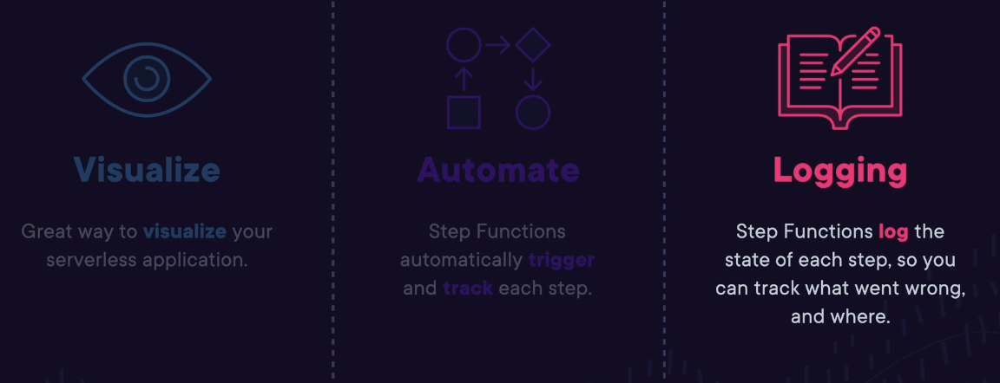

# Deployment, Migration, and AI

## Development, Messaging, and Deployment Technology and Services Lecture

### What is CI/CD?
- **CI (Continuous Integration) /CD (Continuous Deployment)** automates everything (code integration, build, test, deployment) and makes changes easy
- Benefits: Automation, Small changes applied frequently (bug fixes)
- Continuous Deployment Workflow: 
	- Merge: After tests, code is merged w/ master repository
	- Prepare: Code is built/tested/packaged for deployment
	- Deploy: Automatically deploy once ready
- Exam Tips
	- Continous Integration: Integration or merging small code changes frequently (at least once a day)
	- Continuous Deployment: Automating the build test and deployment functions to catch bugs

### AWS Development Tools
- CodeCommit (MERGE): similar to private Git repository
	- A place to store source code, binaries, libraries, and images
	- Code changes and version history
- CodeBuild (PREPARE): Fully managed build and test service
	- Deploys artifacts
	
- CodeDeploy(DEPLOY): Automated deployment service
	- Automatically deploys software to EC2, On Premises, and Lambda
- CodePipeline: Automated CI/CD Pipeline that orchestrates the CI/CD process
	- 
	- When a change in code is made --> the code is built --> when deployed packages are ready --> CodeDeploy
- Exam Tips
	- 

### Demo: Working with AWS CloudShell and the AWS Command Line Interface (AWS CLI)

### Demo: Using AWS Cloud9

### Understanding AWS CodeArtifact
- **AWS CodeArtifact** is a central artifiact repository that lets developers securely store/publish/share software packages needed for development
	- Makes easy to find needed software packages
		- A **package** is a bundle of software
	- Includes open-source and in-house developed software
- **Artifacts**: Documentation, compiled applications, Deployable packages, and libraries
- Exam Tips
	- 

### Decoupling Application Components
- Tight Coupling: 
	- A feature of monolithic application: Where components of an application are interdependent
		- Dependencies between components
	- Problems can occur if one part of the system is faster/slower than another
	- One failed component can bring the whole system down
- **Loose Coupling**: 
	- Seen with microservice based architectures
	- Components operate independently
		- One component doesn't need to wait until another component has completed its work before moving on to the next task
		- A failed/slow component doesn't affect other parts of the system
	- Data and messages are moved b/w components of the application
- Application Integration Services
	- Ingtegration Approach: Queues (SQS - Simple Queue Service, *DECOUPLING*), Notifications (SNS - Simple Notification Service), Events (EventBridge)
- Exam Tips
	- 

### Introducing Amazon Simple Notification Service (SNS)
- **SNS: Set up, operate, and send notifications**
	- SMS text message/email
	- Message sent from an application can be immediately delivered to subscribers or other applications
- A pub-sub Model:
	-
	- Applications publish/push messages to a topic
	- Subscribers receive messages from a topic
- Example: 
- Exam Tips
	- 

### Lab: Create and Subscribe to an AWS SNS Topic

### Introducing Amazon Simple Queue Service (SQS)
- **SQS: A Message Queue System (DECOUPLING)**
	- A **queue** is a temporary repository for messages awaiting processing
	- Messages wait in the queue until the consumer is ready to process them
		- No component gets overloaded by too many requests
		- The system won't crash if a component goes offline
- SQS Example: 
- SQS Key features
	- pull-based
	- Multiple compnoents can add/consume messages
	- Messages are processed asynchronously
	- Guaranteed to be processed at least once
	- Improves performance and the ability to scale and support millions of concurrent requests
- Exam Tips
	- 

### Standard and FIFO Queues
- SQS Standard Queue:
	- Guaranteed that a message is delivered at least once
	- **Best-effort ordering** means that messages are generally delivered in the same order they're send
	- Occasionally more than one copy of a message might be delivered out of order (duplicates)
- SQS FIFO Queues
	- First In First Out Ordering
	- The **order** in which messages are send and received is strictly preserved
	- Exactly once processing means duplicates are not introduced
- Exam Tips
	- 

### Short Polling vs Long Polling
- Polling: settings that controls how frequent users check/poll the queue
- Short Polling: Returns a response immediately even if the message queue being polled is empty
	- 
- Long Polling: Periodically polls the queue. The queue doesn't respond until a message arrives, or the long poll times out
	- 
- Exam Tips
	- 

### What is Amazon Simple Email Service (SES)?
- **SES: A cloud-based email service**
	- Enable your application to send richly formmated HTML emails
	- Confirmation of an order or delivery
	- Marking campaign with details of new launches, special offers, and discounts
	- Send email in bulks
	- Trakc open or click-through rates
- Exam Tips
	- 

### Introducing Amazon EventBridge
- Amazon EventBridge
	- Allows you to easily configure event-driven systems
	- Define tasks that ca be run on a pre-defined schedule
	- **Event-driven architecture**
	- An event is a change in state
- 
	- Events/state changes generated by AWS services (EC2, CloudWatch, and CloudTrail)
	- Rules match events and route them to targets
		- Targets match the event by doing a predefined action, ie. sending an SNS notification
	- Example: An EC2 instance reboots, causing an event to be sent to EventBridge. This triggers a **rule** tha invokes an **action** to send an email using SNS
- EventBridge Scheduled Events
	- EventBridge rules that run on a schedule
	- Can set a rule to run once a day/hour
	- At the same time on a specified day, week, or month
- Exam Tips
	- 
### Understanding Step Functions
- Example: Store Checkout Process
	- 
- Manage the Logic of Your Application
	- Visual interface
	- Build and run serverless applications as a series of steps
	- Each step in your application executies in order, as defined by your business logic
	- The output of one step may act as an input in the next
- Parallel Steps: Step functions can be used for functions that have parallel steps
	- 
- Branching Workflow: Step functions can be used for functions that have a branching workflow
- Exam Tips
	- 

### Deploying Infrastructure as Code with AWS CloudFormation
- Infrastructure as Code: Configure consistent way to use infrastructure as Code
	- **AWS CloudFormation**: Manage, configure, and provision your AWS infrastructure as code
		- Resources defined in a CloudFormation template (.yaml)
		- CloudFormation interprets the template
		- Development: Makes the appropriate API calls to create the resources you have defined --> A CloudFormation Stack
- The Benefits of Using CloudFormation
	- Consistent: Infrastructure is provisionsed consistently, with fewer mistakes
	- Quick and Efficient
	- Free to Use: Only charged for the AWS resources created using CloudFormation
- Exam Tips
	- 

### Lab: Create a DynamoDB Table Using Cloud Formation

### What is AWS Elastic Beanstalk?
- Elastic Beanstalk: Provisions the infrastructure needed to the application you upload, including implementations to download
	- Takes care of capacity provisioning, load balancing, auto scaling, and application health monitoring using CloudWatch
- Elastic Beanstalk Allows Developers to Focus on Code
	- Handles patching/updates
	- No need to worry about configuring underlying structure
- Exam Tips
	- 

### Demo: Deploying an Application Using Elastic Beanstalk

### Demo: Using AWS X-Ray to Identify Performance Issues

