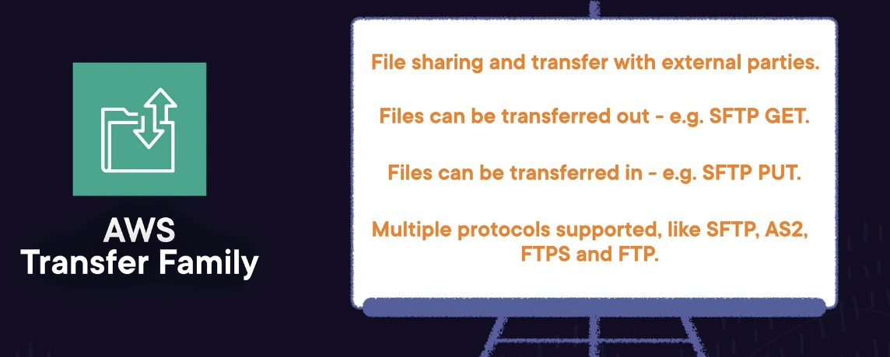
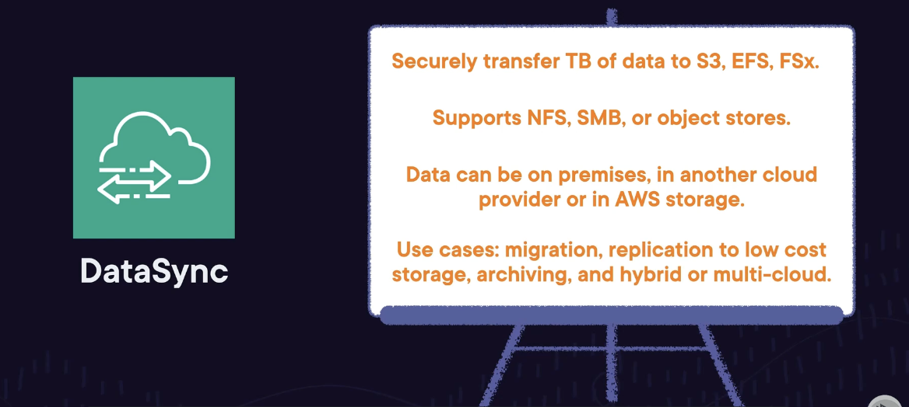
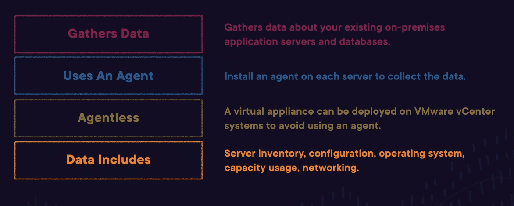
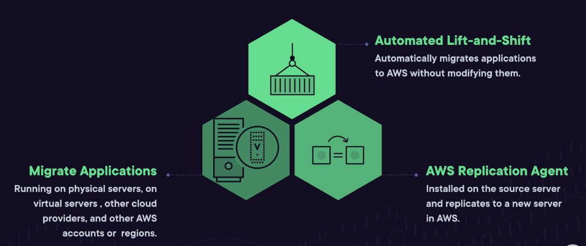
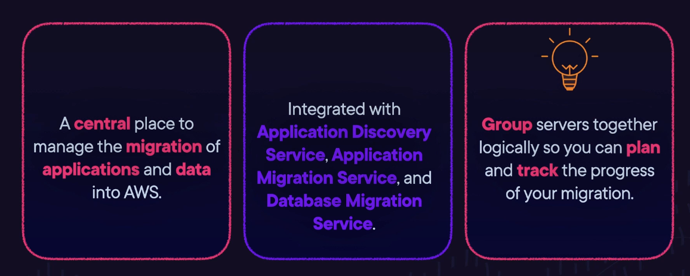

# Deployment, Migration, and AI

## Migration and Transfer Technology and Services Lecture 

### Introducing the AWS Snow Family
- The **Snow Family** of physical devices is used to transfer large amounts of data (10TB+) to AWS
- Snowball device is installed locally to be transfered to AWS
- Variations
	- Snowball: at least 10TB to migrate
	- Snowball Edge: at least 10TB of data to migrate and you also need to process the data
	- Snowmobile: more than 10 PB of data to migrate
	- Snowcone: Small/protable, military grade up to 14 TB device
- Exam Tips:
	- Remember: Snowball, Snowball Edge, Snowmobile, and Snowcone

### Identifying Database Migration Tools
- Database Migration Service (AWS DMS)
	- Used to migrate your database and analytics workloads to AWS. Workloads may be **on premises, on EC2, or in RDS**
	- Your Oracle Database --> AWS DMS --> AWS RDS for Oracle
- AWS Schema Conversion Tool (AWS SCT): Converts from one database schema to another
	- Example: MySQL --> RDS for MySQL
- Exam Tips
	- 

### Exploring the AWS Transfer Family
- **AWS Transfer Family: File Transfer**
	- Business-to-business file transfer using protocols like SFTP, AS2, GTPS, and GTP. Files are transferred into and out of AWS storage like S3 or EFS
		- Example: SFTP PUT
	- Files can be transferred either way
		- Example: SFTP GET
- Benefits of Using the AWS Transfer Family
	- AWS does the heavy lifting for you
	- Highly available, and scalable
	- Users can use existing tools like WinSCP, FileZilla, CyberDuck, lftp, and OpenSSH
- AWS Transfer Family Supported Protocols
	- 
- Exam Tips
	- 

### AWS DataSync
- **AWS DataSync**: Encrypts data to transfer to network of object/file storage
	- High data **throughput**
	- Automated
	- **Pay-per-GB transfer**
- Use Cases
	- Securely migrate all your data to AWS
	- Cost effectively replicate your data using AWS Storage
	- Archive historical data to low cost AWS Storage
	- Support hybrid or multi-cloud workflows
- Exam Tips
	- 

### Understanding AWS Application Discovery Service
- **Application Discovery Service**: Collects data about existing setup, which is sent/stored to AWS Migration Hub (used to coordinate migrating system to AWS)
- What kind of Data?
	- Server inventory,Configuration data, operating system version, capacity utilization, inbound and outbound network connections
- How is the Data Collected?
	- ASD agent installed on applications/servers which is sent to APplication discovery service
- VMWare --> Agentless Collector (which identifies machines nad hosts)
- Exam Tips
	- 

### Introducing AWS Application Migration Service
- **Aplication Migration Service**: Allows you to migrate applications to AWS from physical servers and automatically converts your servers to run on AWS --> **automated lift-and-shift** (not refactored)
	- Process
		- Application Migration Service continuous replication the source servers to the destination servers in AWS
		- Traffic is encyrpted to keep data private
		- Pay for the AWS infrastructure you build, but the Migration service is free to use for up to 90 days
- What's Great about it?
	- Automated
	- Reduced manual effort
	- Windows/Linux supported
- Exam Tips
	- 

### Discovering AWS Migration Hub
- **Migration Hub**
	- Central location to gather application and server inventory information
	- Logically group servers togetehr for migration
	- Enables you to assess, plan, and track migrations to AWS
	- A central place to manage the migration of applications and data into AWS
- Integrates with Other Migration Services
	- AWS Migration Hub --> Application Discovery Service, Application Migration Service, Database Migration Service
- AWS Migration Hub Features
	- Makes recommendations about modernizing applications
	- Replatform Java or .Net applications to run as docker containers in Elastic Container Service
	- Estimate the cost of running your existing workload on EC2 instances in AWS 
- Exam Tips
	- 

### Migration and Transfer Exam Tips

