# Deployment, Migration, and AI

## Artificial Intelligence, Machine Learning, and Analytic Technology and Services Lecture

### Amazon Redshift and Redshift Serverless
- **Amazon Redshift** is a data warehousing service, a system that stores large amounts of data (pb) used for reporting and analytics 
	- ie. combining DynamoDB, S3, etc.
- Features of RedShift
	- Data Warehouse: Fully managed data warehousing solution
	- Massively Parallel Processing (MPP): Able to run complex queries in parallel
	- Automated Data Management: Automatic data backup, replication, and scaling without downtime
	- Designed for OLAP: Suitable for Online Analytical Processing. Great for analytics and reporting
- **data warehouse, OLAP, or online analytical processing** --> Amazon RedShift
- **Amazon RedShift Serverless**: Serverless option of Redshift, eliminates the need to manage infrastructure
- RedShift Use Cases
	- Complex Querying and Reporting
	- Data Lakes Integration (structures/unstructured data)
	- Operational Analytics (ie. Number of deliveries in a queue)
- Exam Tips
	- 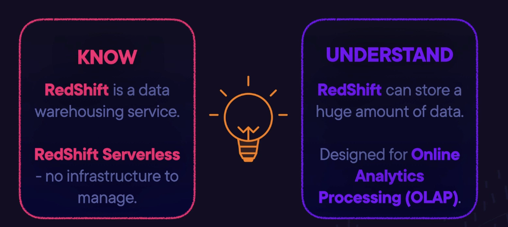

### What is Amazon Kinesis?
- **Amazon Kinesis**: Is a family of services that enables you to collect, process, and analyze streaming data in real time
	- Allows you to build custom applications for your own business needs
- Amazon Kinesis (movement) deals with data that is in motion, or streaming data
- Streaming Data: Data generated continuously by thousands of data sources that send in the data records simultaneously and in small sizes (KB)
	- Example: Financial transactions, stock prices, IoT sensors, Clickstream data, log files, etc.
- **Kinesis Streams**: Stream data and video to allow you to build custom applications that process data in real time
	- Two Options:
		- **Kinesis Data Streams**: lets you process streaming data
		- **Kinesis Video Streams**: Lets you stream video into AWS for storage and processing
- Kinesis Data Streams Process
	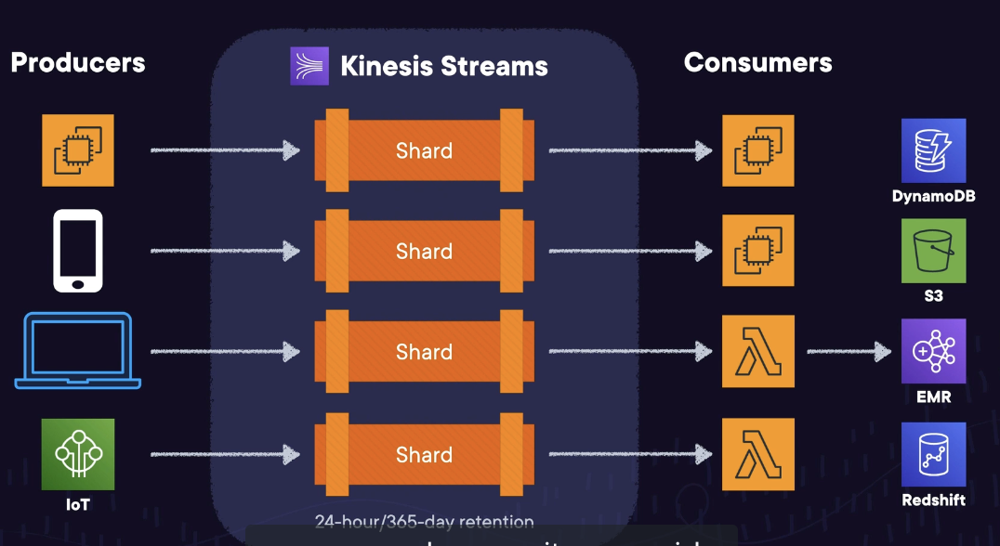
	- Multiple devices' data is stored in **shards** (sequence of data records with a unique sequence number)
	- Data consumers consume the data from the Kinesis shards by analyzing, run algorithms, etc.
	- Data is then stored to permanent storage: DyamoDB, S3, EMR, or RedShift
- Exam Tips
	- 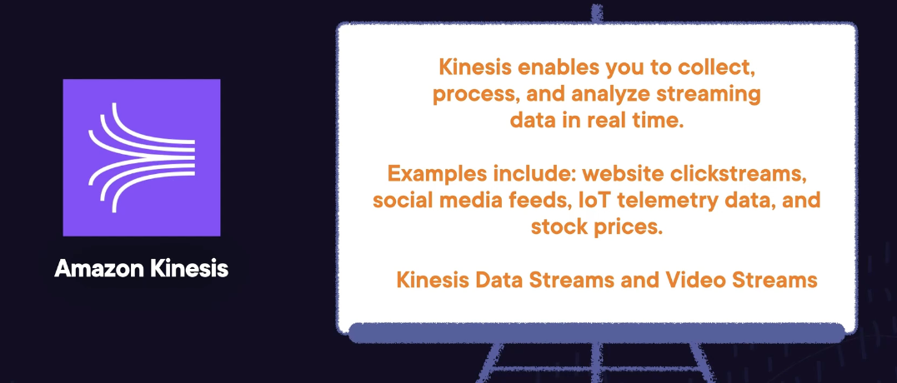

### Exploring Kinesis Data Firehose
- **Kinesis Data Firehose**: Capture, transform, and load data streams into AWS data stores to enable near real-time analytics with BI tools
- Features
	- Easy to Use: Dynamically adjusts resources to handle varying data volues (scales automatically)
	- Real-Time: Processes and delivers data w/in 60 seconds for timely insights
	- Transformation: Custome/enhance data with AWS Lambda before loading
	- Monitoring: INtegrated monitoring with Amazon CloudWatch and automatic error retries
- Process
	- No shards
	- No EC2 consumers BI tools
- Use Cases: Real time analytics, Data Lake Feeding, Log Data Management, IoT Data integration
- Exam Tips
	- 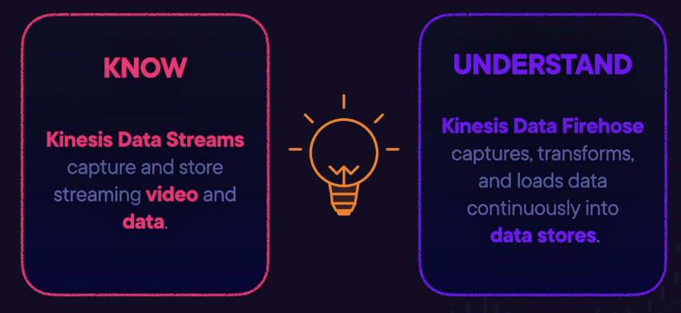

### What is Amazon Athena?
- **Amazon Athena**: Emables you to run standard SQL queries on data stored in S3
	- An interactive query service
	- Serverless, nothing to provision, pay per query / per TB scanned
	- No need for complex Extract/Transform/Load (ETL) processes
	- Works directly with data stored on S3
- Use Cases
	- Query log files
	- Analyze AWS Cost and Usage reports
	- Generate business reports on data stored in S3
	- Run queries on click-stream data
- Exam Tips
	- 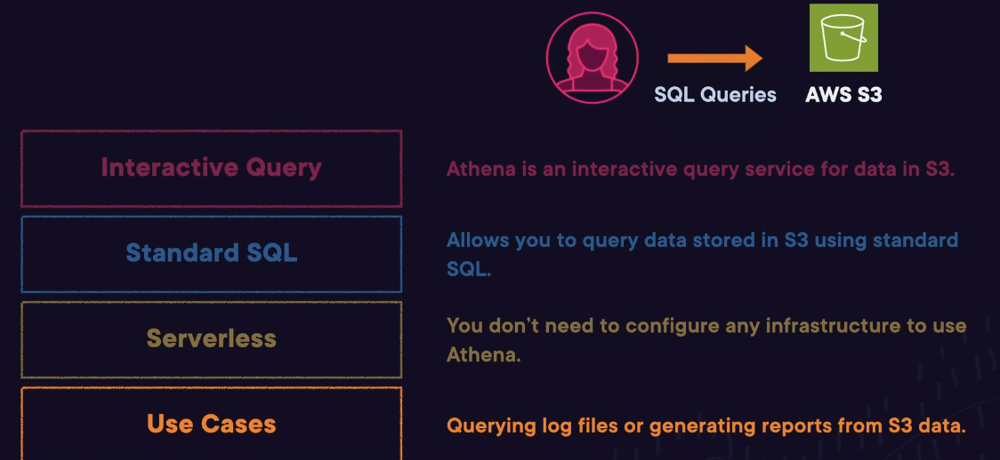

### Demo: Using Athena to Query Data

### Introducing AWS Glue
- **AWS Glue**:
	- Serverless data preparation and integration service
	- Discovers and catalogs your data
	- Performs ETL (Extract, Transform, Load)
- 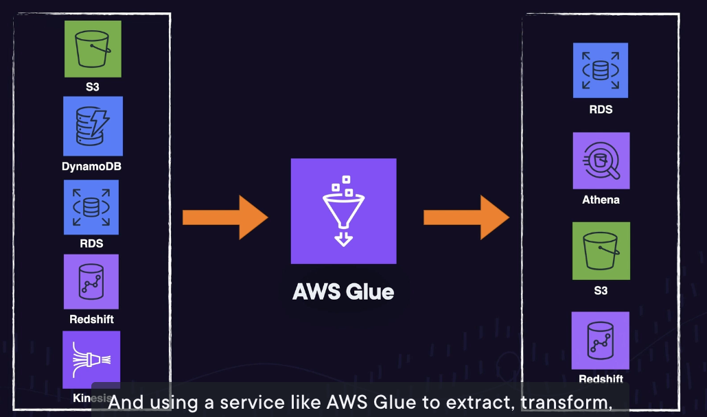
	- Example: Crawlers are used to analyuze data and classifies it t determine a schema for your data
		- AWS Glue then creates metadata tables in a data catalog
	-  Example: Joining Data for a Data Warehouse
		- Joins S3 Customer Data and RDS Clickstream data, extracts then transforms first on AWS Glue, then loads onto RedShift
- Exam Tips
	- 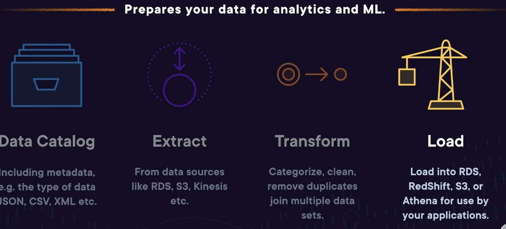

### Exploring AWS Data Exchange
- AWS Data Exchange is a service that allows you to securely exchange and use data that's provided by thid parties on a subscription basis
	- Any data format that can be stored in S3
- AWS Data Exchange
	- 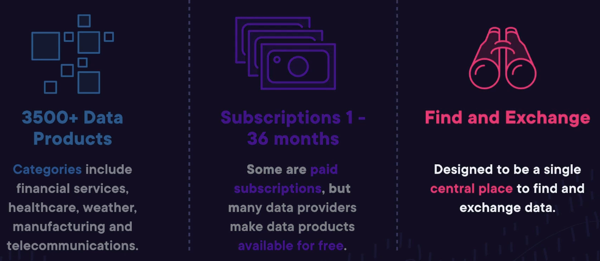
- Can Send and Receive Data Sets With Other AWS Accounts
- Exam Tips
	- 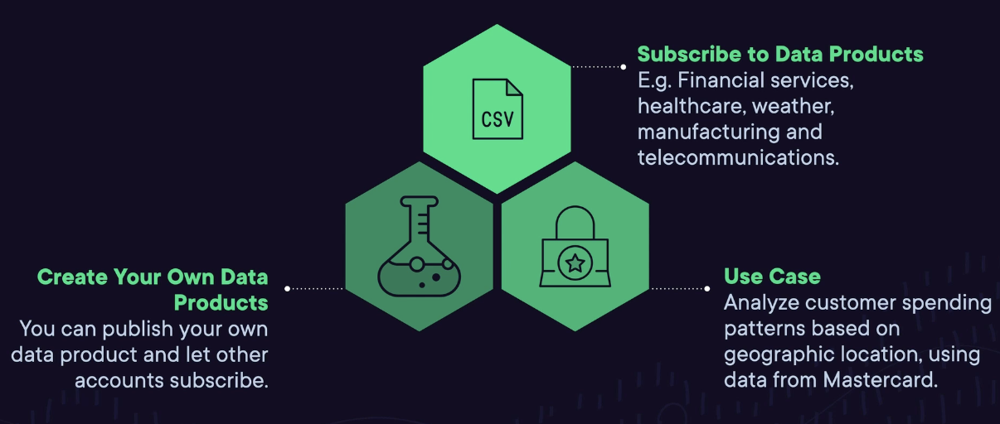

### Understanding Amazon Elastic Map Reduce (EMR)
- **EMR**: A Big Data Platform that does large-scale data processing. Includes Petabye Scale Interactive Analysis
- Suppotrs Multiple Types of Data: Structured Data, and Unstructed Data, Semi-Structured Data, 
- Use Cases:
	- Genomic Data: Statistical algorithms and predictive models to discover patterns, and find correlations
	- Click-Stream: Understand customer preferences and market trends
	- Logs: Proess Logs generated by your applications
- Analyzes data from S3, DynamoDB, RedShift, and Kinesis, and supports open-source Frameworks
- AWS Does the Heavy Limit
	- No need to worry about provisioning and managing infrastructure
	- Configuring and managing open-source applications
	- Capacity planning - can dynamically scale out and in, as required
	- Optimized for performance - Calimed to be faster, and <50% of the cost of on-premises solutions
- Exam Tips
	- 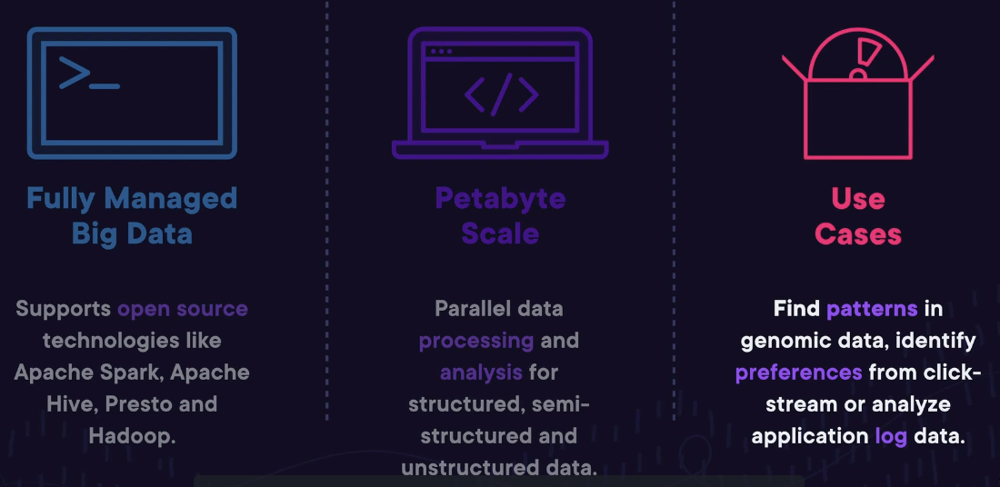

### What Amazon OpenSearch?
- **ElastiSearch**: Widely Used, Analysize Business Data, and Search Log Data
- **Amazon Opensearch**: A fully managed Elasticsearch Service
	- AWS Does all the heavy lifting
	- Software installation and patching
	- Hardware provisioning and configuring the Elasticsearch cluster
- Integrates with data ingestion tools
	- Logstash: data collection and processing
	- Kibana: Data Visualization and search tools
	- CloudWatch
	- CloudWatch Logs and Kinesis Firehouse for data ingestion
- Failure recovery, automated backups, and monitoring
- Exam Tips
	- 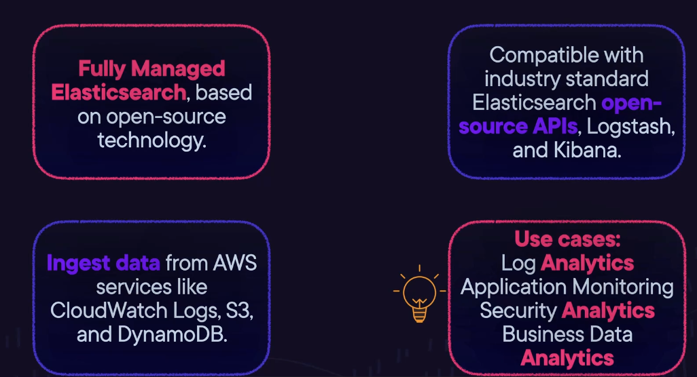

### Exploring Managed Streaming for Apache Kafka (Amazon MSK)
- **Apache Kafka**: A widely used open-source technology that builds real-time data streaming pipelines. It processes streams of events from hundreds of event sources. 
	- Data consumers read the data and process it in the order it was produced
- Apache Kafka clusters can be difficult to set up
	- With MSK, AWS does the heavy lifting
		- Provisioning the cluster, configuring Kafka, and managing upgrades
		- Monitoring, replacing unhealthy nodes, and scaling up when needed
- Similar to Kinesis, though MSK is for customers who would like to use Apache Kafka for their streaming
- Use Case: Track/analyze stock market data in real-time
- Exam Tips
	- 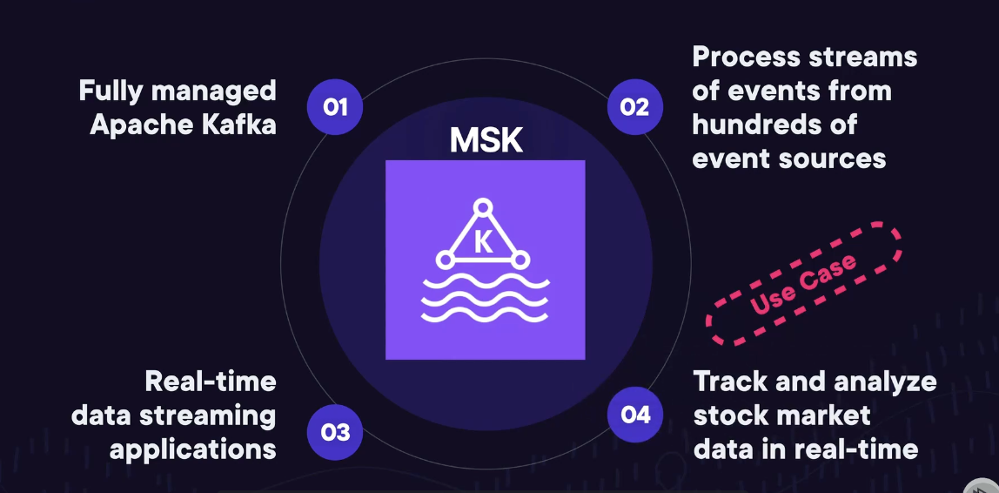

### Understanding Amazon QuickSight
- **Amazon QuickSight**: A software is a SaaS-model business analytics service
	- Connects to your AWS data sources, as well as on-premises data
	- Create dashboards to gain business insights
	- Getting Value from Your Data
- Common Use Cases
	- Sales Performance
	- Application Traffic Data
	- Marketing Campaign Analysis
- Exam Tips
	- 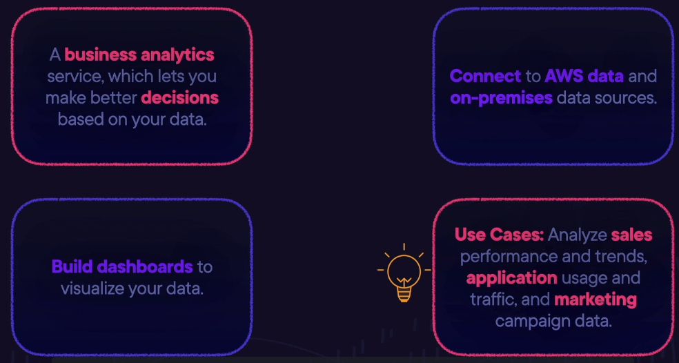

### Machine Learning with Amazon SageMaker
- ML Workflow: Collection/Prepare Data --> Build Model --> Train Model --> Test/Evaluate --> Tune your model --> deploy your model
- **SageMaker**: A Fully Managed ML Platform
	- Prepare Data
	- Build: Includes built-in models, and supports custom models
	- Train: Optimized Infrastructure
	- Deploy: Optimized EC2 instances, serverless, and edge devices
- Use Cases:
	- Recommmendation Engine, Identify Fraudulent Transactions, Predict Insurance Claims, Virutal Customer Service Agent
- Exam Tips
	- 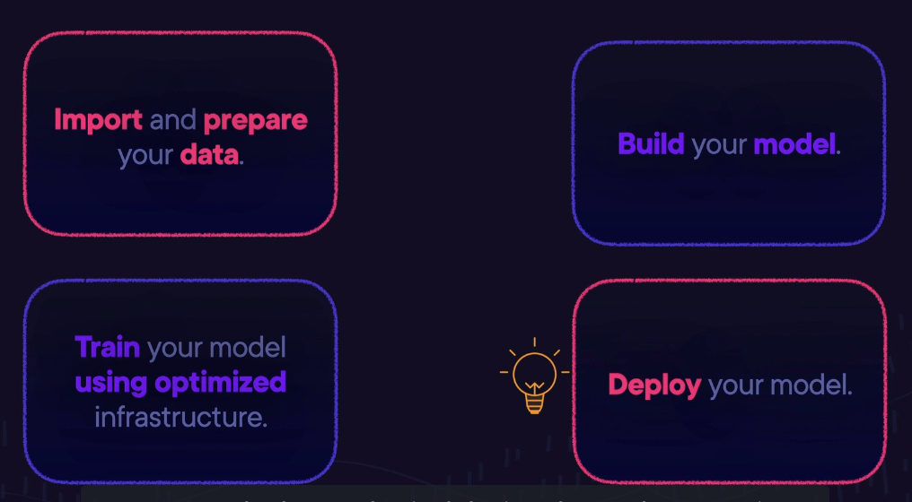

### What is Amazon Kendra?
- **Amazon Kendra**: Natural language processing, Customized Search
	- Data Sources: S3, FSx, RDS, Aurora, Oracle, SQL Server, Websites, Google Drive, Dropbox, Sharepoint, Github
	- Data Types: Unstructured and semi-strucutred ; HTML, XML, PDF, CSV, Microsoft Office (.doc, .ppt)
- How Does it Work?
	- Example: Data in S3 to be queried using natural language. Kendra can first index your data, which can be asked about
	- Fact-based questions: Who/what/when/where
	- Descriptive questions:
- Exam Tips
	- 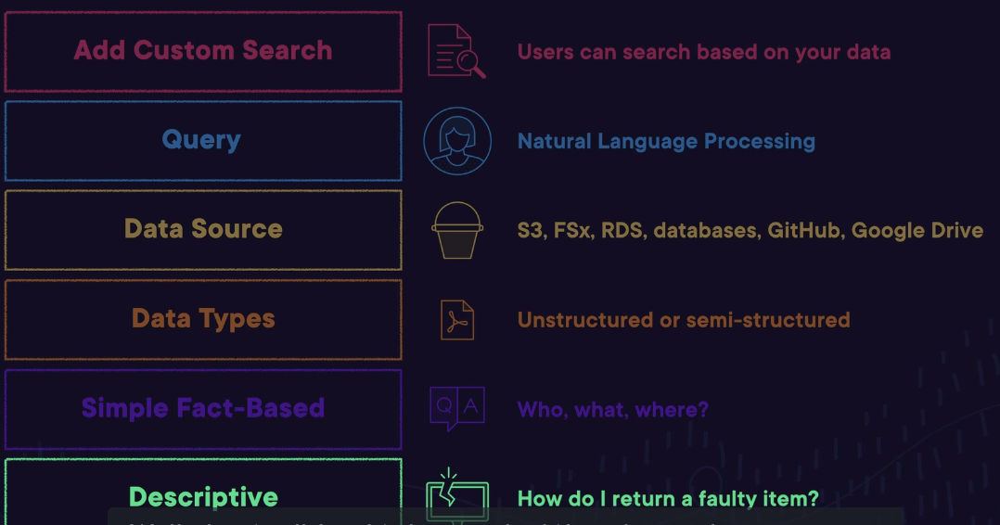

### Understanding Amazon Lex
- **Amazon Lex**: Allows you make a chatbox using natural language models
	- Easy Integration, Speech or Text Input, Multi-Platform Compatibility, Natural Language Understanding
- Use Cases
	- Build Virutal Agents and Voice Assistants
	- Automate Automate Informational Responses 
	- Improve Productivity with Application Bots 
- Lex in the Real World
	- E-commerce websites
	- Healthcare applications
	- Banking apps
	- Hospitality industry
- Exam Tips
	- 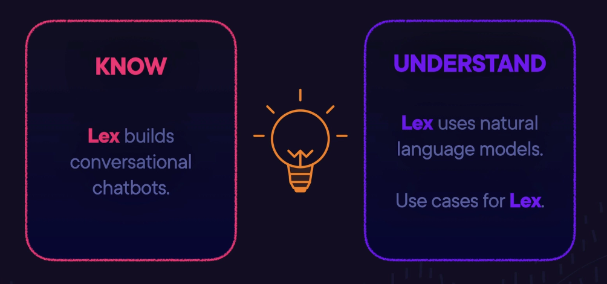

### Demo: Using Amazon Polly

### Introducing Amazon Comprehend
- **Amazon Comprehend**: Uses NLP to process text and discovers insights within text data
- Amazon Comprehend Discover
	- Sentiment analysis
	- Identify language
- Common Use Cases
	- Voice of Customer: positive, neutral, or negative
	- Improved Search
	- Management and Discovery
- Exam Tips
	- 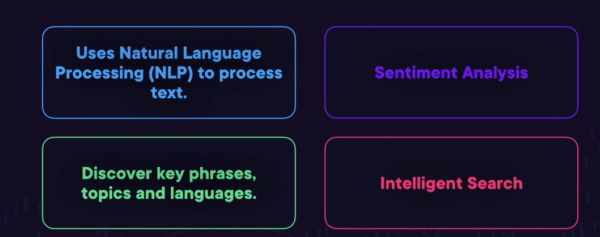

### Amazon Textract, Amaon Transcribe, and Amazon Translate
- Process and generate text
	- **Textract** extracts information from documents
		- Read/Process, Printed or Handwritten, Automated ID Processing, Analyzing Invoices
	- **Transcribe** is a speech-to-text service
		- Speech-to-Text, Streamed Audio, Audio files, Subtitles
	- **Translate** is a language translation service
		- Language translation, large scale, supported language
- Exam Tips
	- 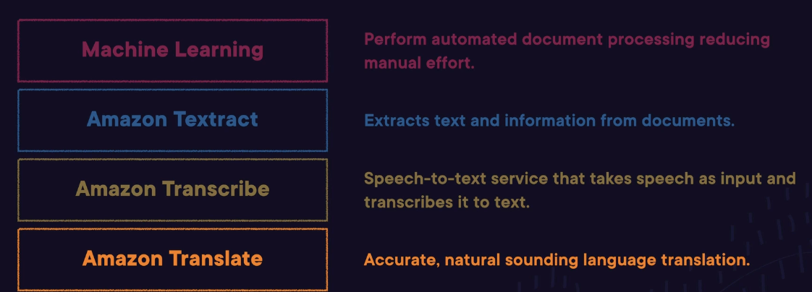

### Demo: Using Amazon Transcribe

### Demo: Amazon Rekognition in Action

### Artificial Intelligence, Machine Learning, and Analytics Exam Tips - Part 1

### Artificial Intelligence, Machine Learning, and Analytics Exam Tips - Part 2
