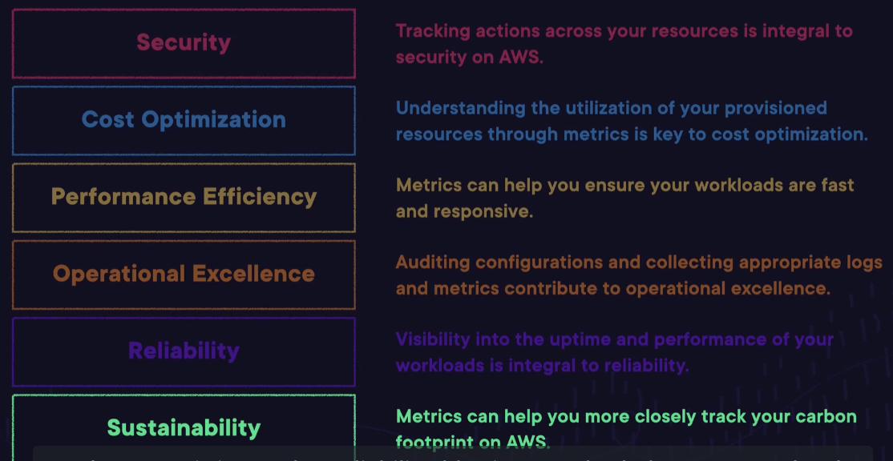
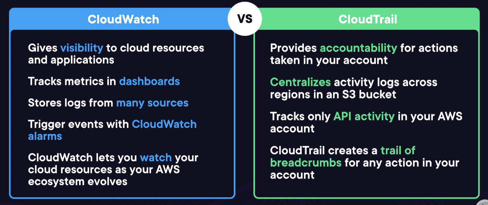

# Monitoring, Security, and Pricing

## Auditing, Monitoring, Logging, and Additional Technology and Services Lecture

### Introducing Monitoring and Logging on AWS
- Collecting and monitoring AWS ecosystem
	- **Metrics**: Numerical representations of capacity/demand
	- **Logs**: Record of what has happened to make sense of errors/events
	- **Configuraitons**: Settings/Guidelines
- Collecting Motrics
	- AWS services can publish metrics to monitor workload health and inform design decisions
	- Examples: Lambda errors, EC2 CPU utilization, RDS read latency
	- Used to trigger automated events, create notifications to be analyzed by human/AI
- Log Producers
	- Derived from logs and track actions on infrastructure
	- Logs used to track actions 
- Configuration Management
	- Resource Settings/Standards
	- Types and properties of resources to be standardized
	- Require monitoring: Standardizing configurations requires both prevention and detection
	- Automatic Configurations at Scale
-  
- Exam tips
	- Understand why it is important to collect logs/metrics
	- Keep the **Well-Architected Framework Pillars** in mind

### Exploring Amazon CloudWatch and AWS CloudTrail
- CloudWatch vs CloudTrail
	- 
- CloudWatch Dashboards and Alarms
	- For EC2, application and some instance metrics can't be collection w/out CloudWatch Agent: Free Memory, Percentage of Disc Space Used, Custom Application Metrics, etc.
- CloudTrail
	- API actions are tracked by Cloudtrail, which leaves a trail of "breadcrumbs"
- Exam Tips
	- Understand the diference between **CloudTrail** and **CloudWatch**, and how they each contribute to observability and security
	- Understand what a **CloudWatch dashboard** is and how you can set **alarms** on them (important for observability and error handling)

### Demo: Getting to Know CloudWatch Dashboards

### Managing Many Resources on AWS
- **Tags**: Are a key value pair that could be tagged to any resource, which can be selected
- **Systems Manager**: Group resources on AWS, on premises, or on other cloud platforms and take automated actions on those groups
	- View aggregated operational data of resource groups
	- Can store sensitive data: Passwords, database strings, license keys
- Exam Tips
	- Understand how **tags** can help you sort/visualize cloud resources on AWS
	- **Systems Manager** allows you to track **resource groups** and perform **automated acitons** on premises, on AWS, or on other cloud platforms

### Lab: Visualize Metrics for Tagged Resources on Amazon CloudWatch

### Monitoring Service Health and Best Practices
- **AWS Health Dashboard**: Displays impacted services
	- View the status of services and regions relevant to the workloads running in your AWS account
- **AWS Health API**: Leverage the AWS Health API if you are building a custom observability application
- **Trusted Advisor**: One stop advisor that has a built-in set of rules with best-practice suggestions with some free checks
	- Checks: open security groups, IAM user, MFA enabled on root, service limits, public RDS snapshots, public EBS volume snapshots, S3 permissions allowing open access
		- More available with Business or Enterprise
- Exam Tips
	- Monitor **service health** by using the **AWS Health Dashboard** and **API**
	- Monitor **Best Practices** by following the advice of **Trusted Advisor**

### Understanding Auditing on AWS
- Auditing is a continous process of monitoring passive configurations for security and best practices
	- Sometimes done against a set of standards to achieve industry-specific compliance
	- Example: Trusted Advisor
- Auditing Concepts:
	- Data Encryption, Secure CloudTrail, Public Access, Resource Provisioning, Networking SEcurity, and Protect Credentials
- **AWS config**: Leverages pre-defined recommendations or create custom rules
	- Detects non-compliant resources and alerts administrators in the console. (Doesn't stop from using. If want to avoid, use IAM)
	- Odesn't enforce standards, but audits adherence
- **Audit Manager**: Centralize audit data from AWS Config and security services
	- Find root causes of noncompliance and generate reports
	- Provides pre-build auditing frameworks to meet industry standards: HIPAA, NIST Cybersecurity, AWS Operational Best Practices, etc.
- Can also use ***AWS Well-Architected Tool**: Asses your worklaods, learn about best practices, and generate action plans
- Exam Tips
	- **AWS Config** is the backbone of configuration **auditing**
	- **Audit Manager** and **The Well-Architected Tool** help you asses your AWS resources to achieve **best practices** and **compliance standards**

### Identifying Business and End User Services
- **Amazon Connect**: A cloud-based contact cetner
- **Amazon Workspaces**: Provision remote desktops for dispersed workers
- **Amazon AppStream**: Converts applications to software-as-a-service for employees or end useres
- Exam Tips
	- **AmazonConnect** is a **Business Service** that allows you to provision a **contact center** in the cloud
	- **Workspaces** and **AppsStream** are **End User Services** that enable you to give access to **Virtual Desktops** and **applications** hosted on AWS

### Auditing, Monitoring, and Logging Exam Tips

