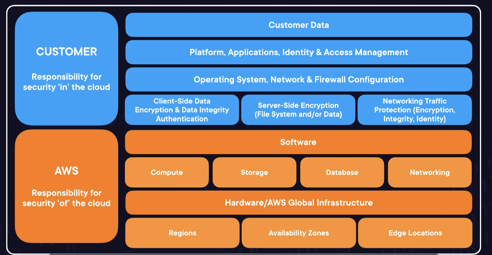

# Monitoring, Security, and Pricing

## Security, Compliance, and Governance Lecture

### Security: The Bigger Picture
- The Shared Responsibility Model
	- 
	- Developer is responsible for security in the cloud while AWS is responsible for security of the cloud
		- Example:
			- AWS is responsible for the security of data centers and all of the software and interconnections that define the AWS Cloud
			- You are responsible for the resources you provision, user acess, and customer access to those resources/applications
- Security: Focuses on protection of data, systems, and any assets used by your workload
	- Identity and Access Management
	- Data Stewardship and Encryption
	- Network Security
	- Application Security
	- Compliance
	- Security Management

### What Do we Need to Secure on AWS
- The Shared Responsibility Model: Data
	- Customer Data: Access, Retention, Encryption, and Backups 
	- Platform, Application, Identity and Access Management: interconnections with public clouds or other data centers
	- Operating System, Network & Fireball Configuration: Make sure EC2 VPC is up to date with operating system, Secure connection to AWS, and customers only have the permissions that they need
	- Encyrption: Client-side, server-side, and network traffic
		- Only people with the "code" can have the ability to "unscramble" the data
- It is possible to everage some of the customer data responsibilities on the AWS by leveraging managed services
	- Example: EC2 and RDS

### Illustrating the Principle of Least Privilege
- The principe of **least privilege** states you should grant only permissions needed to complete a task
- Reducing Impacts means eliminating the possibility of accidents
- Granular Permissions: IAM (Identity and Access Management)
	- Applied on Users, AWS, and applications on AWS
	- Permissions to say who can enter and what they can do
- Exam Tips
	- Know that the principle of least privilege states you should only grant permissions needed to complete a task
	- Understand that **IAM** is the key AWS service for **Identity and Access Management**, and it allows you to assign granular permissions
		- Defines what/who enteres and what they can do

### IAM
- IAM is how you control all user access to your AWS account and AWS resources 
- Root User: creates AWS account, and the only user that can destory the account
	- Multi-factor Authentication (MFA) used to secure credentials
- IAM Policies
	- Permissions are defined by IAM Policies
	- Can be given to users or groups
- IAM User Access
	- If given access, can connect through CLI or AWS Console (Username/Password)
	- Long lasting access keys are a security risk. Schedule automatic rotation of IAM access keys
- IAM Policies: attached to users, grou
ps, or roles
	- IAM Roles access keys automatically rotate by design
- Additional IAM Tools
	- IAM Access Analyzer: Identify resources with external access validate IAM policies, and generate IAM policies based on usage
	- **IAM Policy Simulator**: Test new IAM policies before granting them to users, user groups, and roles
- Exam Tips:
	- Know that **IAM Policies** can be attached to users, user groups, and roles. They are called **identity based policies**
	- Understand that **long-lasting** access keys and passwords are **secuirty liabilities**. If possible, use **IAM roles** and automatically **rotating keys**

### Lab: Troubleshooting an IAM Policy on an EC2 Instance

### Keeping Secrets Safe
-  Encyrption at Rest - S3
	- Encyrpted by default using SSE-S3 Managed Keys
	- Amazon macie: searches your S3 buckets for PII (eronally identified information)
- Encyrption at Rest - Elastic Block Store
	- Key Management Service (KMS)
- Encyrption at Rest - RDS
	- To encrypt an exiting RDS instance, you must create a copy encrypt the copy
- Encryption at rest means protecting your data **in place**
- Encyrption in Transit
	- Amazon VPC: Traffic within a VPC is encrypted by default
	- HTTPS protocol is secure, compared to HTTP
		- HTTPS encrypts your data in transit using TLS (Transport Layer Security)
		- Use Certificate Manager to support HTTPS protocol
	- Encyrption in transit means protecting your data while it's on the move
- Systems Manager Paramter Store: can securely store passwords, database strings, and other values for reference
- Secrets Manager: Adds another layer of security by enabling automatic rotation of your "secrets"
- Exam Tips
	- Understand the difference between **Encryption in transit** and **encryption at rest**, S3 is **encrypted by default**, other services will use **KMS** for encyrption at rest
	- Know that **Systems Manager, Parameter Store, and Secrets Manager** allow you to protect sensitive parameters. Only **Secrets Manager** allows for rotating secrets

### Exploring Network Security Services
- Network Access Control Lists (NACLs): provide stateless access control in your VPCs and subets 
- **Security Groups**: Provide stateful access control for particular reasons
- Together, security groups and network access control lists can help define access control for resrouces in Amazon VPCs (though not enough)
- **Network Firewall**: Filters based on origin but also defines complex rules to inspect traffic w/in VPC
- **AWS WAF**: Web Application Firewall that protects against such as SQL Injection, Malicious Traffic, or Cross Eyed Scripting
	- Protects web applications from common exploit (excpept one)
- **AWS Shield**: Shields against DDoS (distributed denial of service)
	- Shield Advanced: 24/7 protection
- AWS Firewall Manager: helps administer network security from a single service: Netowrk Firewall, AWS WAF, and AWS Shield
- Exam Tips:
	- Remember that AWS WAF can help protect your web applications from common exploits, such as SQL injection or cross-site scripting
	- Know that AWS Shield protects your AWS resources from DDoS attaacks, Shield Advanced provides additional protection and a 24/7 response team

### What is Security Hub?
- Secuirty Hub: manages multiple security services
	- Firewall manager: Sends findings on unprotectd resources and when a DDoS attack is underway
	- Guard Duty: Tracks activity logs across your AWS account, sends findings in response to malicious behavior
	- Inspector: Inspects your workloads for vulnerabilities and network access, sends its findings Security Hub
	- Systems Manager: Patch Manager detects noncompliant resources and sends findings to Security Hub
	- IAM Access Analyzer: Uses detective guardrails to find noncompliant resorces and sends findings to Security Hub
	- AWS Health: REports service outages relevant to your AWS resources and sends findings to Security Hub

### Demo: Exploring Security Hub

### Responding to Security Events
- AWS Trusted Advisor: Provides Best Practice Advice
	- Cost Optimization, Service Limits, Security, Operational Excellence, Fault Tolerance, Performance
- Amazon GuardDuty: Collects activity logs from around AWS and uses machine learning to intelligently detect threats
	- Detects actove Threats
- Amazon Detective: Investigates security events that have already happened
- Amazon Inspector: Inspector continuously scans your workloads for software vulnerabilities and network exposure
	- Detects vulnerable workloads
	- continously scans compute workloads such as (EC2) and detects software and network vulneratbilities

### Growing Your Security Muscles
- AWS Cloud Secuity: The main landing page for security information on AWS
- AWS Security blog: Stays up to data with innovation and announcements around security
- AWS Marketplace: Find pre-built security solutions from third-party vendors (for operational efficiency)

### Governing Multiple Acconuts on AWS
- An **account** is a collection of resources that a user can log into and contribute to
	- Best Practice: Make multiple AWS accounts for different projects
	- Centralized with a management account
- **AWS ORganizations**: Administer multiple AWS accounts from a single ponit, consolidating cost while organizing and limiting access to resources
	- Config rules detect noncompliant resources across your organizations. Can be applied to multiple or individual accounts
	- Service Control Policies prevent actions across your organization
- **AWS Control Tower**: Automate account creation and the application of best-practice Config rules and SCPs
- Security + Organizations = centralized view of security alerts across multiple accounts
- Exam Tips
	- Understand why a company might want multipl accounts, and how Organizations can help. Control Tower helps you manage your organization and automates guardrails
	- Know that Securityhub can integrate with Organizations to centralize security alerts and compliance status across multiple accounts

### Understanding Compliance on AWS
- Compliance is a Shared Responsibity
- AWS Artifact: Download AWS security and compliance documents, provide them to regulators, and inform your cloud architecture
- Audit Manager: Automate assessments against frameworks designed to meet common compliance standards
- Security Token Service: AWS STS enables you to request temporary credentials for users such as auditors
- Security and Compliance is a shared responsibility, but demonstrating compliance in the cloud is ultimately the customer's responsibility
- Exam Tips
	- Know that not all AWS services are in scope for all compliance programs. Be aware of how to transfer daata or store security keys in highly regulated industries

### Security, Compliance, and Governance Exam Tips