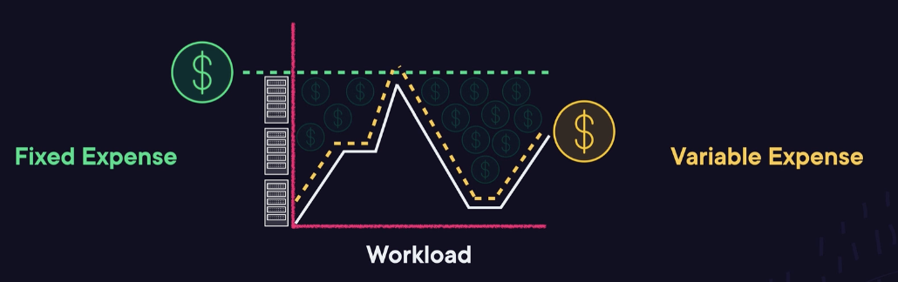
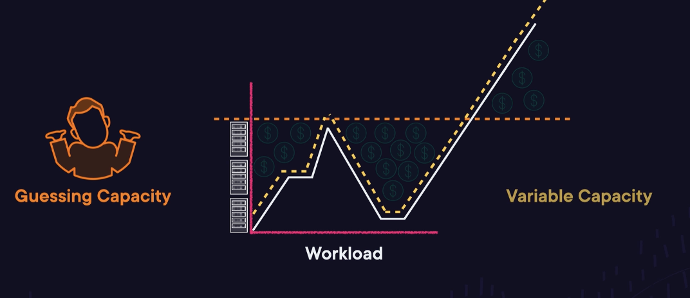
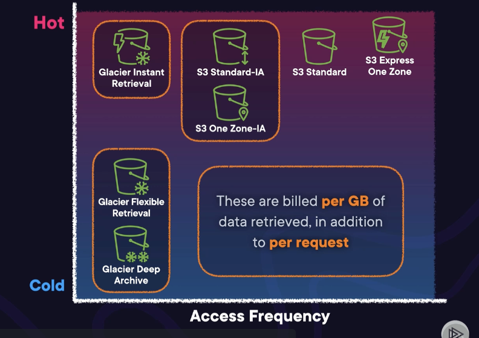

# Monitoring, Security, and Pricing

## Pricing, Billing, and Support Lecture

### Cloud Costs: The Bigger Picture
- TCO: Total Cost of Ownership
- Cloud Computing Advantages
	- Trade fixed expense for variable expense. Benefit from massive economies of scale. Stop guessing capacity. Increase speed and agility. Go global in minutes
- Expenses
	- 
- Capacity
	- 
- AWS aggregates usage from users --> These economies of scale allow AWS to offer low pay-as-you-go prices
- Cost optimization is important for sustainability as well

### Optimizing the Cost of Compute
- Don't use Cloud like a Data Center
	-  Wasted compute for keeping EC2 running example
- Autoscaling: Allows to put EC2 instances into auto scaling groups and these instances will start and stop to help to meet demand when needed
- Right-Sizing Instances: Meet the curve demand
- Reserved Instances: Sign for a contract for levels that you expect
	- Standard: Particular instance type
	- Convertible: Flexible
	- Scheduled: For certain days
- Spot Instances: Discount up to 90%, though can start/stop anytime due to availability
- **Compute Optimizer**: Uses machine learning to analyze your CloudWatch utilization metrics, and provides right-sizing recommendations for your EC2 instances
- On-Demand
	- **AWS Lambda**: Lambda has no idle cost and is great for serverless or event-driven workloads        
	- **AWS Fargate**: Fargate is a serverless container compute option for containerized workloads
- Exam Tips
	- Know the appropriate use cases for reserved instances (RI) and spot instances
	- Understand that Compute Optimizer can be used to right-size your EC2 Instances

### Understanding Data Storage Costs
- Storage Classes
	- S3 Standard, S3 Standard-IA, S3 One Zone-IA, S3 Express One Zone, Glacier Flexible Retrieval, Glacier Deep Archive, Glacier Instant Retrieval
	- 
- S3 Lifecycle Configuration: Create per-object policies that define transition actions and expiration actions
- S3 Intelligent Tiering: For cost savings on unknown access frequencies
- S3 Storage Lens: Gives recommendations after examining all the S3 buckets in your organization
- Exam Tips
	- Know the different S3 Storage Classes and how you can use lifecycle configuyrations and teh Intelligent Tiering class to transition objects from one to another
	- Understand that S3 Storage Lens examine your S3 buckets organization-wide to inspect access patterns and storage optimization recommendations

### Lab: Creating an S3 Storage Lifecycle

### Understanding Data Transfer Costs
- Two types of data transfer: inbound and outbound
	- Or within on a region (say, in AWS)
	- Or across AWS clouds
- Inbound data transfer from the internet to AWS is always free
- Outbound data transfer to the internet varies in cost by service
- Inter-Region data transfer is billed per GB depending on the origin and destination
- Data transfer costs within one region vary by service, but can in some cases be free
- Rule: Avoid unncessary internet data transfer
- Data Transfer Costs (from Most expensive, to least)
	- Outbound traffic to public internet
	- Data transfer across regions
	- Data transfer across availability zones
	- Data transfer within availability zone
- The further the data has to physically travel, the more expensive it would be
- Exam Tips:
	- Know that you should always avoid routing traffic to the public intern when it can travel over the AWS network backbone instead
	- Understand that the cost of data transfer within AWS changes depending on whther you're sending data across AZ's or Regions

### Monitoring and Predicting Costs on AWS
- Monitoring and Predicting Costs Process
	- 1 Assess your potential cloud costs
		- Using Price Calculator: Assess potential cloud costs
	- 2 set up cost safety nets before you start to build
		- AWS Budgets: Set customized budgets and receive SNS alerts when exceed your thresholds
	- 3 Project and monitor actual cloud cost
		- Cost Explorer: A dashboard to gain insights on AWS usage and project spend
	- 4 Analyze historical cost data
		- Cost and Usage Reports: Give the most detailed data on cost and usage history

### Demo: Setting a Budget Alert in Your AWS Account

### Managing Costs in a Multi-Account Environment
- AWS Organizations provides consolidating billing
	- Monitor costs across your organization from a single account and take advantage of bulk discounts
- **Billing Conductor**: Allows you to create billing groups within your AWS Organization. Distribute bulk discounts across billing groups and set custom pricing rates
- Exam Tips
	- Know how to centrally manage costs across accounts using **Consolodated billing** which is a feature of **AWS Organizations**
	- Understand that you can further group cost management and billing in your **AWS Organization** using **Billing Conductor**

### Monitoring the Cost of Resource Groups
- Tags (key value pair) used to group resources
	- Can set AWS Budgets, Cost Explorer, or Cost&Usage Reports for specific tags

### Seeking Support from AWS
- AWS Support: Receive in 
	- Support Plans (Basic Free)
		- Trusted Advisor Free checks
		- AWS Health dashboard
		- Access to customer service and documentation
	- Developer
		- + General Guidance within 12-24 hours depending on severity
	- Business
		- Full set of Trusted Advisor checks
		- + Contextual guidance within 1-24 hours
		- + 24/7 access to phone/web chat for advice
	- Enterprise On Ramp
		- Contextual guidance within 30 minutes
		- Limited consultative review and guidance
		- Proactive guideance from a pool
		- Concerige access to billing issues
	- Enterprise
		- Unlimited consultative review/guidance
		- Proactive guidance from a designated advisee
		- Proactive support in managing billing
- Exam Tips
	- Know that a business support plan is the lowest cost to achieve phone and char support and the full set of Trusted Advisor checks
	- Enterprise support is needed for concierge-like billing assistance and guidance from Technical Account Managers

### Exploring Other Sources of Support
- **AWS IQ**: Find AWS Certified freelancers and consultants
- **AWS Managed Services**: Pre-configured security and operations management
- **AWS Professional Services**: A team of AWS Experts
- **AWS Activate**: Support and exclusive offers from startups

### Pricing, Billing, and Support Exam Tips