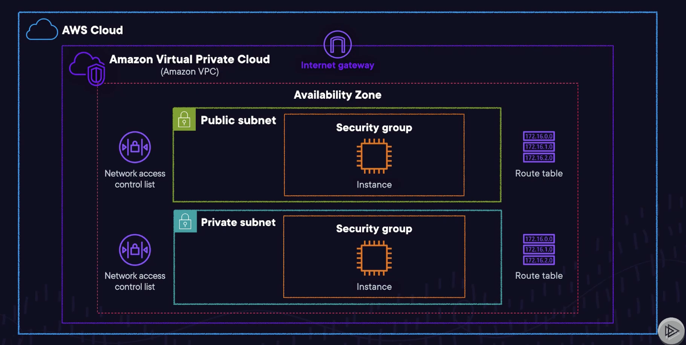
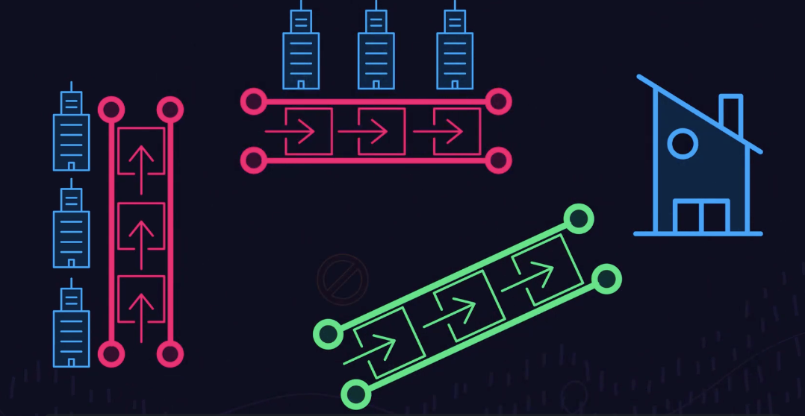

# Storage, Networking, and Databases

## Content Delivery and Networking Lectures

### Content Delivery: The Bigger Picture
- A **Content Delivery Network (CDN)** is a global network of interconnected servers that ensures your website's content reaches the customers efficiently
- Example: A network of pizza delivery routes that can the pizzas to users/customers around the world. These kitchens (or edge locations) store your pizza ready to deliver
- Key Benefits of a CDN
	- __Speed__: Removes the complexity or distance between user/content of deploying and maintaining file systems
	- __Reliability__: Automatically scales on demand without disruption applications (rerouting in case failure)
	- __Global Reach__: Multiple EC2 instances can access an EFS system simultaneously
- **Amazon CloudFront** (AWS CDN)
	- CloudFront charges for data transfers, but the first TB is free with AWS free trial
	- Works by **caching your content** through multiple data centers called **edge locations** all over the world
		- When a user requests your content, CloudFront serves it from the edge location nearest to the user
			- **Reduces latency**, the time taken for data to travel between the server and the user
	- Enhances __Security__: Integrates with AWS Sheild, and AWS Web Application Firewall
	- __Optimizes other Services__: Such as S3, EC2, and Route 53 --> Scalability
- Amazon CloudFront Use Cases: Streaming Videos, Secure Transaction (Credit), Traffic Spikes (Product Launch), Detailed Analytics (Insights on user behavior)
- __Exam Tips__
	- Understand the benefits of a **CDN**, especially **CloudFront**
	- Understand what is an **edge location**
	- Know Cloudfront integrates with other AWS services
	- Real-world applications include streaming and e-commerce

### AWS Global Accelerator
- A **Global Accelerator** is a networking service that sends user traffic through AWS's global network infrastructute enhancing applications performnace and availability
- Example: Express lanes on a delivery route finding the quicker/optimal path
-  Cloudfront uses edge locations to cache content while Global Accelerator uses edge locations to **find an optimal pathway to the nearest regional endpoint**
- Benefits of AWS Global Accelerator
	- Improved Performance: Propel through congestion-free network (60% increase in throughput)
	- __Simplified Traffic Management__: Users can access your two global static public IPs that act as application endpoints --> Optimize performance and cost
	- __Security and Reliability__: DDoS Resiliency and Automatic Reroute (in case of issue)
	- __Consistent Global User Experience__: Intelligent routing sends user traffic to the endpoint that provides the best performance
- Use Cases
	- __Global User Base__: Worldwide audience (ie. streaming service)
	- __High Traffic Events__: Sales events / product launches, helping manage influx with the "express lane"
	-__ Multi-Region Applications__: Acts as a single entry point for all the traffic
	- __Latency Sensitive Applications__
- Exam Tips
	- Understand the core application is **performance** by directing traffic through Amazon's high-speed private global network
	- Understand when you might want to use **global accelerator** 
		- *It shines in cases of global user bases, high-traffic events, and multi-region applications*
	- Know AWS Global Accelerator offers **security** and **reliability**
	- It integrates with other **AWS services**

### Networking: The Bigger Picture
- Example: A secure isolated section of a cloud kitchen with complete control over virtual networking environment. It includes workstations/subnets/access rules/security groups/connections to the outside world (internet gateways)
- Key Components
	- 
	- Within the AWS Cloud is the **Amazon Virtual Private Cloud (VPC)** which has **subnets (private/public)** which further segment the VPC to organize and secure resources
	- **Availability zone** contains the subnets
		- **Public subnet**: Can be configured to be accessible to *outside world*
		- **Private subnet**: Reserved for a database, for example, only accessible by organization
	- **Route tables** are each associated with a subnet which act as the traffic rules of the VPC and determine where the network for its associated subnet to go
	- **Security Groups**: Control inbound/outbound access to resources such as an EC2 instance
	- **Network Access Control List (NACL)**: An extra layer of security that control traffic moving in/out of the subnets (ie. checkpoint security guards)
- Understanding Subnets in a VPC
	- **Public subnet**: Resources here can be accessed from the internet
	- **Private subnet**: Not directly accessible from the outside world
- Internet Gateways & Route Tables
	- Work together to manage traffic
	- **Internet Gateway**: Responsible for routing outgoing requests and incoming traffic (ie. main door)
	- **Route Table**: Have entries or routes that determine where network traffic from your subnets should go (ie. instructions for staff to take orders to inside or outside)
		- Each subnet must be associated with a route table 
			- Public subnets are associated with route tables that have a route to an internet gateway, allowing resources to access/be accessed from the internet
			- Private subnets might have routes that keep traffic contained within the VPC or route it to corporate networks via VPN or AWS Direct Connect
- Security in Your VPC
	- **Security Groups** act like the guidelines for what is allowed in/out of each area of your kitchen
		- Operate at the instance level: Make decisions about who can enter/exit, serving as firewalls
		- Allow you to specify allowable protocols, ports, and source/destination IP ranges
		- Security groups are stateful (if traffic allowed in one direction, return traffic is automatically allowed regardless of inbound rules)
	- **Network ACLs** serve as an extra layer of security , providing a set of rules that control traffic in/out of the subnets
		- Operate at the subnet level: Provide a layer of defense for all instances w/in the subnet
		- Stateless: Don't remember previous interactions, therefore inbound/outbound rules need to be set separately to control traffic
		- They can allow or deny traffic based on protocol, port, and source/destination IP addresses
	- Security groups are more granular controlling access to individual instances and maintaining state
	- NACLs provide a broader layer of defense without maining state
- __Exam Tips__
	- Understand the purpose of a **VPC** in which it allows you to provision a logically isolated section of the AWS cloud
	- Understand that within a VPC, you can launch AWS resources in a virtual network that you define
	- Understand the different components: subnets, route tables, and internet gateways
	- Understand how to use subnets to segregate resources based on exposure to the internet and internal usage
	- Know the significance of **Security Groups** and **NACLs**
	- Know the difference between **Public** and **Private Subnets** 

### Demo: Exploring Networking Services - VPC in Action

### Lab: Launch an EC2 Instance in a Virtual Private Cloud (VPC)

### DNS: The Bigger Picture
- **Domain Name System (DNS)** is a globally distributed service that translates human-readable names into a numeric IP address
- Example: The big phone book of the internet that finds the corresponding IP address
- **Amazon Route 53** is the AWS DNS service that also provides domain name registration and health-checking web services
- Amazon Route 53 Features
	- __Sophisticated Traffic Routing__: Geolocation routing, latency-based routing, and weighted round-robin routing (send small portion of traffic to a server)
	- Health Checks: Performs health checks on your resources (ie. routes traffic away from failed/unhealthy endpoints)
	- DNS Failover: Automatically redirects users to a secondary location
	- Scalability and Integration: Scales automatically with your demand and integrates seamlessly with other AWS services
- Practice Uses
	- __Web Application Routing__
	- __Load Balancing__: Distribute incoming traffic across multiple targets (ie. containers and IP addresses)
	- __Global Traffic Management__
	- __Domain Name Registration and Management__: purcahse and manage domain names
	- __Private DNS for Amazon VPC__: Can be used to manage internal DNS names of EC2 instances, which provides user friendly names that can only be resolved without your VPC
- __Exam Tips__
	- Understand DNS and Domain Names
		- DNS translates human-friendly domain names into machine readable IP addresses
	- Understand Route 53 Traffic Routing: Simple, geolocation, and latency-based routing
	- Understand Route 53's health checks that monitor health/performance of resources
	- Understand Private DNS in VPC: Route 53 can be used to managed the DNS of your AWS resources that is accessibly only w/in your VPC
	- Understand that Route 53 is not just for DNS queries but also for managing global traffic
	- Understand that Route 53 has domain registration and management

### Applying Hybrid Models with Networking Services
- **AWS Direct Connect** provides a direct private connection from your data center to AWS, bypassing the public internet
	- 
	- Example: Private road built exclusively for your use 
	- Benefits of AWS Direct Connect
		- High-Speed Data Transfer: Ideal for transferring large volumes of data quickly/consistently
		- Reducing Bandwidth Costs: More cost-effective for extensive data transfer compared to internet-based transfers
		- Reliable Connection: Free from public internet disruptions
- **AWS VPN** encrypts your data, safegarding as it travels over the internet to AWS
	- Example: Armored vehicle transporting ingredients safely on public roads
	- **Site-to-Site VPN**: Secure connection between your data center or branch office and your AWS
		- Ideal for entire networks
	- **Client VPN**: Secure access to your AWS resources or your private network from any location
		- Ideal for individual remote access
- VPN vs Direct Connect
	- Direct Connect
		- Large-scale data transfer
		- Consistent performance
		- Sensitive Data
	- VPN
		- Encrypted over public internet (employees working from home or remote locations)
		- Cost-effective
		- Quick/easy setup
- Exam Tips
	- Understand AWS Direct Connect: Private connection
	- Understand AWS VPN types: Site-to-site (entire networks) and Client VPN (individual access)
	- Understand Direct Connect vs. VPN
	- Recognize the security offered by VPN through encryption and recognize direct connect provides a more stable and faster connection

### Content Delivery and Networking Exam Tips
- Cloud Data Network: Speedy delivery routes 
	- AWS CloudFront works by caching content to data centers called edge locations, served nearest to the users
- AWS Global Accelerators: Directs traffic through optimzed paths
	- Beneficial for Global instances, high traffic, multiple regions --> Reduces complexity
	- Has built-in DDos protection and can be integrated w/ other AWS services (ie. load balancing, EC2, and S3)
- Amazon Virtual Private Cloud (VPC)
	- Located within an availability zone that is isolated from failures in other availability zones
	- Public subnets: front-end servers that are accessible from the internet
	- Private subnets: back-end systems like databases
	- Route tables: control the flow of traffic w/in the 
		- Each subnet within a vpc is associated with a route table that dictates where its traffic should go
	- Internet gateway: Determines what resources in public subnets communicate with the internet
	- Security groups: Virtual firewalls for EC2 instances, controlling inbound/outbound at the instance level, stateful
	- NACLs: Security at the subnet level controlling both inbound/outbound traffic, stateless
- DNS with Route 53: Finds corresponding IP address to a website URL
	- Domain name registration
	- Health checks and failover
	- Routings: geolocation, latency-based, weighted round-robin
	- Scales automatically
	- Integrates w/ AWS services
- Hybrid Networking with Direct Connect with VPN: Encrypts data and bypasses public internet for a direct route
- AWS VPN: Armored path
	- Site-to-Site: creates secure connection b.w data center and your AWS environment
	- Client VPN: securely access private network from any location

## Content Delivery and Networking Quiz